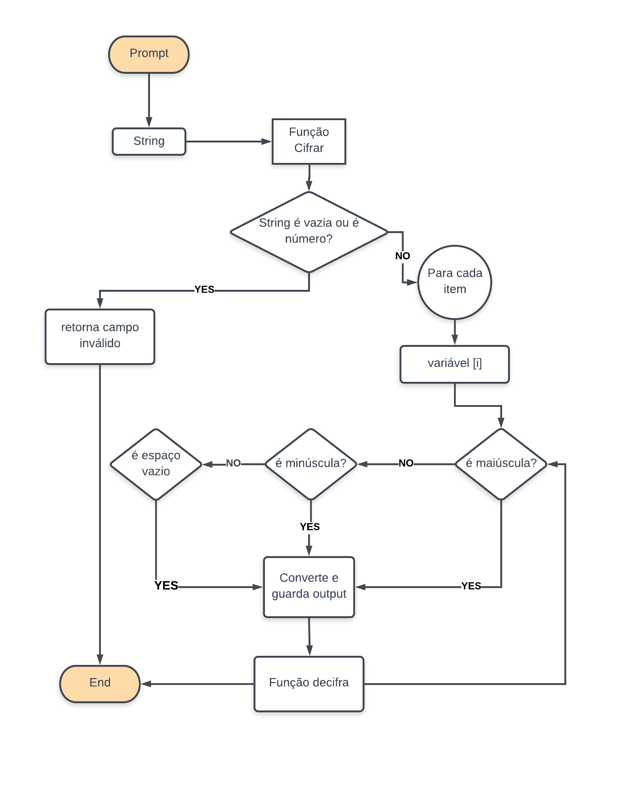

# Laboratória Sprint I - Produtos Finais

# Cifra de César

Sprint 1 - LABORATÓRIA - Produto final I - Cifra de césar JS

## About/ Sobre

* Exercise for bootcamp *<laboratória>* 2018 - Ceasar cipher with fixed amout 33.
* Exercício para bootcamp *<laboratória>* 2018 - Cifra de césar com parâmentro fixo em 33.

### Pseudocode / Pseudocódigo

Em português
===================

1. Recebe frase/string através do Prompt
2. Função cipher recebe o valor pelo parâmetro str (tipo string)
3. Uma var output string vazia que irá receber o valor cifrado no fim do ciclo For seguinte
4. Um If se o campo estiver vazio ou for cadeia de números retorna campo inválido
5. Ciclo For para cada item da string uma variável char guarda o valor do item
6.  Dois Ifs um para maiúsculas e outro para minúsculas verifica se char através do método .charCodeAt(0) está dentro dos códigos
referentes a maiúsculas e minúsculas na tabela ASCII 
 	- entre 65 e 90 para maiúsculas
 	- entre 97 e 122 para minúsculas
 	- 32 é o espaço vazio
 7. Se letra maiúscula var code segura valor através do método .charCodeAt(0) - 65 para que a posição do index coincida com a posição na tabela ASCII da letra. 
A var output acrescenta cada letra (+=) passando var code com método String.fromCode(code) pela fórmula da cifra de césar (n + 33) % 26 soma os espaços retirados do método .charCode(0) ou seja + 65  para retornar a letra correta da tabela ASCII. 
 Se letra minúscula var code segura valor através no método .charCodeAt(0) - 97 para que a posição do index coincida com a posição na tabela ASCII da letra 
 A var output acrescenta cada letra (+=) passando var code com método String.fromCode(code) pela fórmula da cifra de césar (n + 33) % 26 soma os espaços retirados no método .charCode(0) ou seja + 97  para retornar a letra correta da tabela ASCII. 
 8. Função cipher retorna a string codificada.
 9. Uma variável strCiphered guarda a função cipher com argumento variável string do prompt
 10. Função decipher com a mesma estrutura da função cipher 
 11. Para retornar a posição na tabela ASCII  var code recebe  var char com método charCodeAt(0) + 65 para maiúsculas e + 97 para minúsculas
 A var output recebe char acrescentando através do método String.fromCharCode(0) aplicando a fórmula de decifrar para minúsculas continuar somando 33 ao invés de subtrair, para compensar intervalo entre 90 e 97.
 12. Função decipher retorna string decodificada se o argumento de entrada for a variável que guardou o valor codificado.
 
 

## Running the tests

``var test1 = cipher('');
var test2 = cipher(43);
var test3 = cipher("ABCDEFGHIJKLMNOPQRSTUVWXYZ abcdefghijklmnopqrstuvwxyz")
console.log("Mensagem cifrada");
console.log(cipher(strInput));
console.log("Mensagem decifrada");
console.log(decipher(strCiphered));
console.log([test1 === '', test2 === '', test3 === "HIJKLMNOPQRSTUVWXYZABCDEFG hijklmnopqrstuvwxyzabcdefg"]);``

## Authors

  * **Donna Kether** 
 
## Acknowledgments

* Hat tip to anyone whose code was used - https://gist.github.com/EvanHahn/2587465

